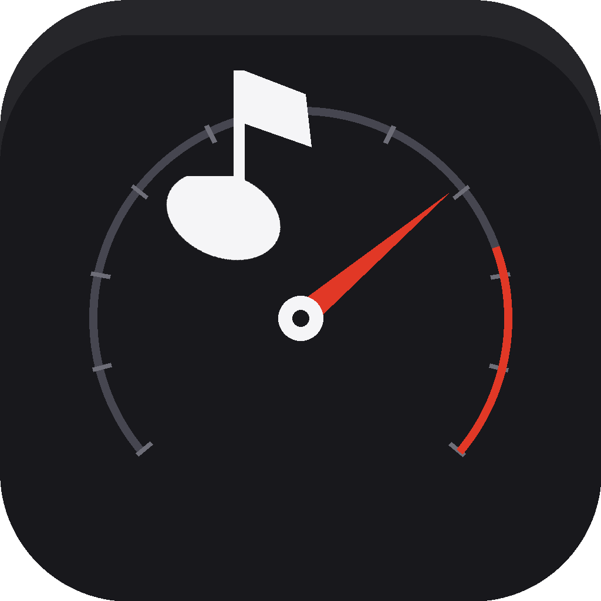
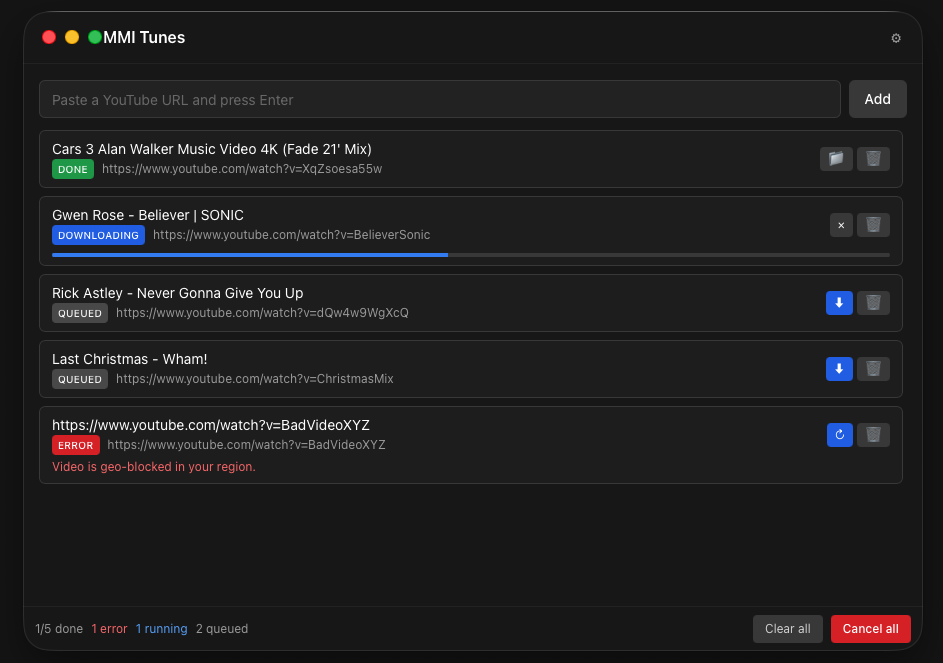
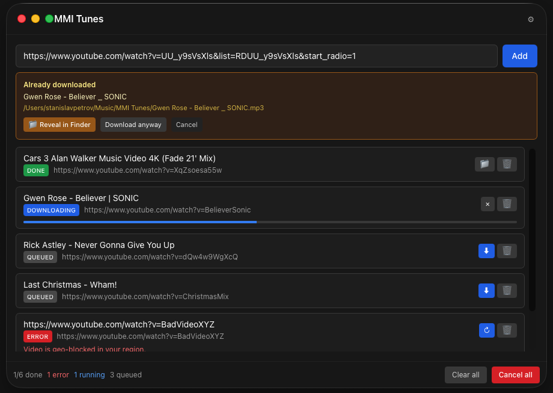
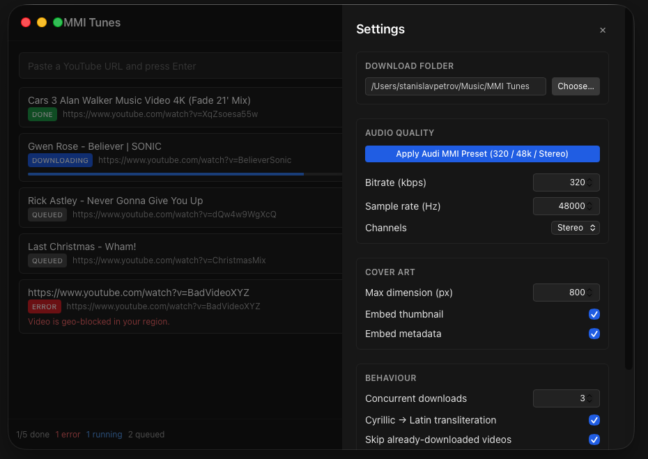

# MMI Tunes

<p align="center">
  
</p>

<p align="center">
  <strong>YouTube → Audi MMI–compatible MP3, in two clicks.</strong>
</p>

A macOS app that downloads YouTube audio and converts it to MP3s that fully comply with the Audi MMI 3G+ specification — so the tracks play on the in-car system with title, artist, and cover art on the dashboard, no "unsupported format" surprises.

## What it does

<p align="center">
  
</p>

- Paste a YouTube URL → click → MP3 file in `~/Music/MMI Tunes/`.
- Bitrate, sample rate, channels, and cover-art size are automatically tuned to Audi MMI's spec sheet.
- Multiple URLs download in parallel (configurable, default 3).
- Real-time progress bars per track, with stage labels (downloading → converting → embedding cover).
- "Already downloaded?" check stops you from grabbing the same video twice — and shows you where the existing file is so you can drop it on your SD card.
- Automatic Cyrillic → Latin transliteration in filenames so they survive on FAT32 SD cards.
- Survives bad URLs, geo-blocked videos, age-gated content, network drops, and YouTube's bot checks with friendly error messages.

<p align="center">
  
</p>

## Audi MMI compliance, automatic

Every output MP3 hits the Audi MMI 3G+ spec sheet:

| Spec | Audi MMI limit | What MMI Tunes produces |
|---|---|---|
| Codec | MPEG-1/-2 Layer 3 | `.mp3` |
| Bitrate | ≤ 320 kbit/sec | **320 kbps CBR** |
| Sample rate | ≤ 48 kHz | **48 000 Hz** |
| Channels | Stereo | **2** |
| ID3 metadata | Album, track, artist, year, genre, comments | Pulled from YouTube + embedded |
| Cover art | ≤ 800×800 px (JPEG/PNG/GIF) | **Auto-resized** to fit |
| Filename | FAT32-safe (no `\ / : * ? " < > \|`) | **Sanitised + transliterated** |
| Files per directory | ≤ 5000 | Pre-flight warning |

The numbers in the table above come straight from Audi's MMI manual page **Controls ▸ Media drives/connections ▸ Supported media and file formats**. The full spec sheet is also documented in [this AudiWorld forum thread](https://www.audiworld.com/forums/q5-sq5-mki-8r-discussion-129/mmi-3g-largest-sd-card-size-2872958/).

Tested on **Audi MMI 3G+** (Audi Q7 4LB).

## Install

```bash
brew install yt-dlp ffmpeg
cp -R "build/bin/MMI Tunes.app" /Applications/
```

First launch: right-click the app in Finder → **Open** → confirm. macOS shows a Gatekeeper warning once because the build is unsigned (no Apple Developer account); after that it launches normally from Spotlight, Dock, or `open -a "MMI Tunes"`.

## Usage

1. Paste a YouTube URL into the input field, press Enter.
2. The clip appears in the list — click ⬇ to download just that one, or **Download all** at the bottom for the whole batch.
3. When the row turns green and shows ✔ Done, click 📁 to reveal the file in Finder.
4. Drag onto an SD card formatted as FAT32, slide it into the Audi, drive.

### Settings (⚙ icon, top-right)

<p align="center">
  
</p>

- **Download folder** — defaults to `~/Music/MMI Tunes`.
- **Audi MMI Preset** — one click sets bitrate to 320, sample rate to 48000, stereo, cover ≤ 800 px.
- **Concurrent downloads** (1–5).
- **Embed metadata / thumbnail**, **Cyrillic transliteration**, **Skip duplicates**, **Auto-detect clipboard URLs**.

## How it works

```
┌──────────────────────────────────────────────────────────────┐
│  React UI (Tailwind + Zustand)                               │
│  ↕ Wails event bus + auto-generated TS bindings              │
│  Go App struct                                               │
│  ├─ queue.Queue   worker pool, per-job context.CancelFunc    │
│  ├─ settings.Store / history.Store / queue.Save+Load         │
│  └─ downloader.Download                                      │
│      └─ yt-dlp --extract-audio --audio-format mp3 …          │
│          └─ ffmpeg (invoked by yt-dlp)                       │
│      └─ postprocess.ResizeCoverArtInMP3 (Go, bogem/id3v2)    │
└──────────────────────────────────────────────────────────────┘
```

Persistence:

```
~/Library/Application Support/MMI Tunes/
├── settings.json   user preferences
├── history.json    completed video IDs (for dedup + Reveal)
└── jobs.json       full job list (resumes across launches)
```

## Tech stack

- **Backend** — Go 1.23, [Wails v2](https://wails.io), [`bogem/id3v2`](https://github.com/bogem/id3v2), `golang.org/x/image/draw`.
- **Frontend** — React 18, TypeScript, Vite, Tailwind CSS, Zustand.
- **External CLIs** — [`yt-dlp`](https://github.com/yt-dlp/yt-dlp) and [`ffmpeg`](https://ffmpeg.org/), installed via `brew`. (Future: bundled inside the `.app` so no `brew install` is needed.)

## Development

```bash
# Prereqs (one-time)
brew install yt-dlp ffmpeg
go install github.com/wailsapp/wails/v2/cmd/wails@latest

# Live-reload dev (Go + React both hot-reload)
wails dev

# Run tests (race detector on)
go test -race ./...

# Production build → build/bin/MMI Tunes.app
wails build -platform darwin/arm64
```

The smoke-test CLI is useful when iterating on the downloader engine without re-launching the GUI:

```bash
go run ./cmd/cli "https://www.youtube.com/watch?v=…" /tmp/mmi-out
```

## Roadmap

Done:

- [x] MMI-compliant downloader (320 / 48 kHz / stereo / cover ≤ 800×800)
- [x] Concurrent worker pool with cancel + retry
- [x] Settings persistence + history dedup
- [x] React UI with progress bars, settings drawer, dedup prompt
- [x] yt-dlp stderr categorisation (geo, age, Premium, bot-check, network)
- [x] App icon, full `-race` test suite

Maybe next:

- [ ] Bundled `yt-dlp` + `ffmpeg` (no `brew install`)
- [ ] Auto-update yt-dlp from inside the app
- [ ] Playlist URLs (one URL → many tracks)
- [ ] M3U playlist file generation
- [ ] Drag-and-drop URLs from a browser
- [ ] macOS notifications when batches finish
- [ ] Apple Developer signed + notarized release (no Gatekeeper warning)

## License

MIT — see [LICENSE](LICENSE).
